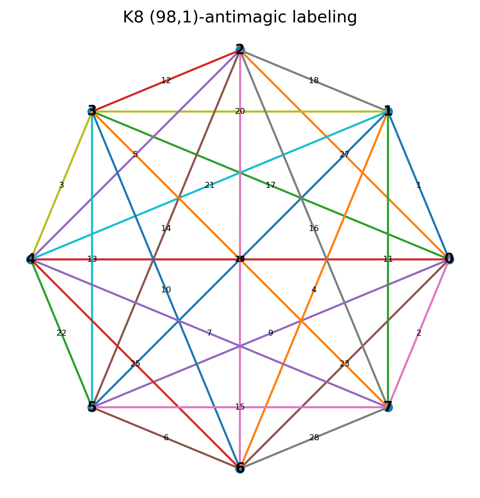
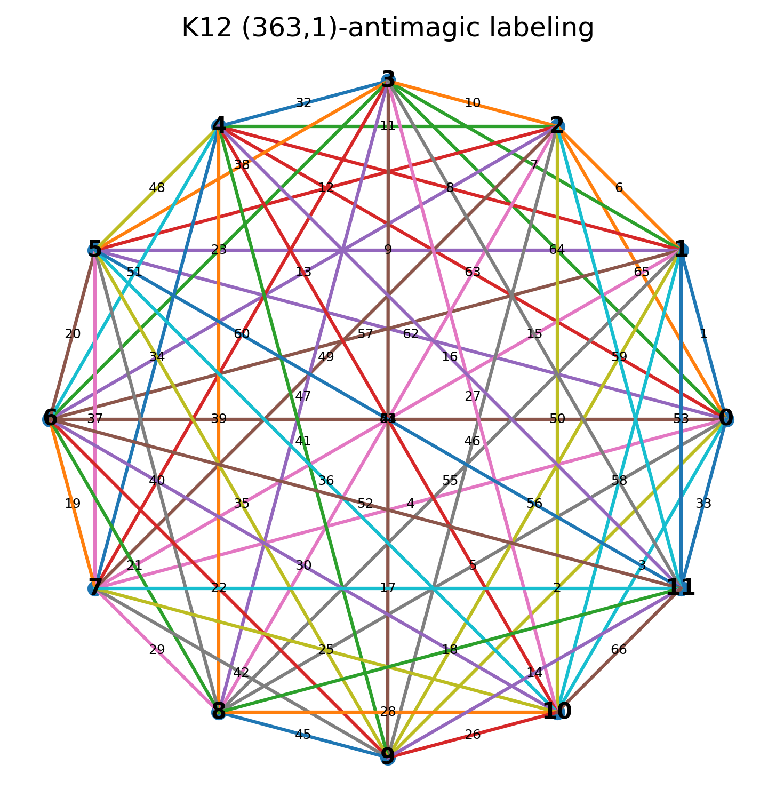

## **Overview**

This repository contains the code and computational results for determining whether the complete graphs
**K₈** and **K₁₂** admit **(a,1)-antimagic labelings**.
The project is based on ongoing work on antimagic labelings of zero-divisor graphs and related graph families.

The computation uses Google OR-Tools (CP-SAT solver) to explicitly construct an (a,1)-antimagic labeling whenever it exists.

---

## **Background**

A graph **G = (V, E)** with **|E| = m** is **(a,1)-antimagic** if there exists a bijection

```
f : E → {1, 2, ..., m}
```

such that the induced vertex-sums

```
g(v) = sum of f(e) over all edges e incident to v
```

are all distinct and form the consecutive sequence

```
a, a+1, ..., a + |V| - 1
```

From Lemma 2.3/3.3 of our manuscript, the required parameter **a** must satisfy:

```
a = ( m(m+1) - n(n-1)/2 ) / n
```

This formula strongly restricts when an (a,1)-antimagic labeling is possible.

---

## **Results**

Using constraint programming, this project confirms:

### ✔ **K₈ is (98,1)-antimagic**

The solver constructs a valid labeling with vertex sums:

```
98, 99, 100, 101, 102, 103, 104, 105
```

### ✔ **K₁₂ is (363,1)-antimagic**

The solver constructs a valid labeling with vertex sums:

```
363, 364, ..., 374
```

These results complete the two previously unknown entries in the study of (a,1)-antimagic complete graphs.

---

## **Results**

Using constraint programming, this project confirms:

### ✔ **(K_8) is (98,1)-antimagic**

The solver constructs a valid labeling with vertex sums
[
{98, 99, 100, 101, 102, 103, 104, 105}.
]

### ✔ **(K_12) is (363,1)-antimagic**

The solver constructs a valid labeling with vertex sums
[
{363, 364, ..., 374}.
]

These results complete the two previously unknown entries in the study of ((a,1))-antimagic complete graphs.

---

## **Repository Contents**

```
solve_kn_antimagic.py   # OR-Tools CP-SAT solver for (a,1)-antimagic labeling
analysis.py             # Visualization script (or Jupyter notebook)
K8_antimagic.png        # Labeled diagram for K8
K12_antimagic.png       # Labeled diagram for K12
README.md               # This file
```

---

## **Usage**

### **1. Solve for Kₙ**

```python
from solve_kn_antimagic import solve_kn_antimagic

result = solve_kn_antimagic(8)   # or 12
print(result)
```

### **2. Draw the labeled graph**

```python
from draw_kn_labeling import draw_kn_labeling_from_result
draw_kn_labeling_from_result(result, save_path="K8.png")
```

---

## **Dependencies**

* Python 3.8+
* OR-Tools

  ```bash
  pip install ortools
  ```
* matplotlib (for visualization)

---

## **Figures**

### **K₈ (98,1)-antimagic labeling**



### **K₁₂ (363,1)-antimagic labeling**



---
